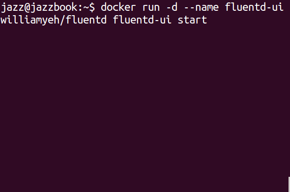
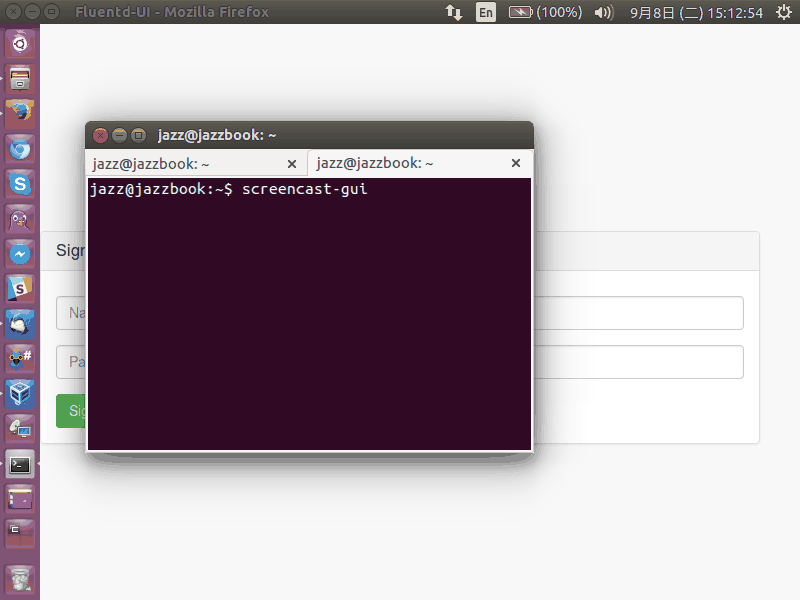
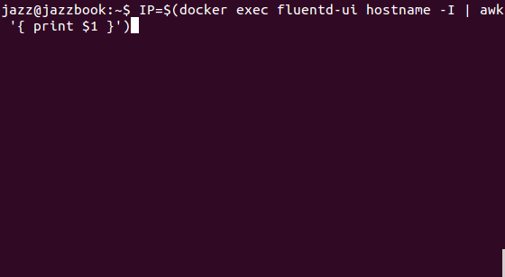

# Lab 1 - Fluentd 起手式

想學習 [Fluentd](http://www.fluentd.org) 嗎？ [Docker](http://www.docker.com) 是您的好朋友!!

感謝 [William Yeh 葉秉哲](https://twitter.com/williamyeh) 製作的 [fluentd (td-agent) docker image](https://hub.docker.com/r/williamyeh/fluentd/)，內含 [fluentd](http://www.fluentd.org) 與 [fluentd-ui](http://github.com/fluent/fluentd-ui)

以下透過三個 GIF 動畫簡單展示一下 Fluentd 的 in_http 與 out_stdout 兩個 plugin

--------

**圖 1 : 使用 williamyeh/fluentd docker image 帶起 fluentd-ui**



## STEP 1

首先，使用 `williamyeh/fuentd` 這個 image 啟動一個名為 `fluentd-ui` 的 docker instance，並使用 `fluentd-ui start` 做為啟動參數

```
$ docker run -d --name fluentd-ui williamyeh/fluentd fluentd-ui start
```

## STEP 2

檢查是否正常開啟於 9292 連線埠

```
$ docker logs fluentd-ui
```

## STEP 3

使用指令檢查 fluentd-ui 的 IP 位址

```
$ docker exec fluentd-ui hostname -I
```

--------

**圖 2 : 登入 Fluentd UI 並啟動 Fluentd**



## STEP 4

小撇步：使用指令產生 fluentd-ui 的 URL

```
$ echo "http://$(docker exec fluentd-ui hostname -I | awk '{ print $1 }'):9292"
```

點選產生的 URL 就可以看到 Fluentd 的網頁介面

## STEP 5

1. 使用 fluentd-ui 預設帳密登入 `admin` / `changeme`
2. 選擇 `Setup Fluentd` 然後按下 `Create` 按鈕，使用預設值將 Fluentd 的設定檔與日誌檔存放於 /root/.fluentd-ui/ 目錄下。
3. 按下 `Start` 按鈕，啟動 Fluentd 的背景程式。

**圖 3 : 登入 Fluentd UI 並啟動 Fluentd**




## STEP 6

以下示範如何送資料到 fluentd 的 `in_http` plugin

以下是在 Ubuntu 底下，使用 curl 送出 POST 到 fluentd daemon 的 9880 連線埠，JSON 內容為 { "action":"login", "user": 2 }

您也可以透過瀏覽器的網頁開發者介面或 [Firefox RESTful Client](https://addons.mozilla.org/en-Us/firefox/addon/restclient/) . [Chrome RESTful Client](https://chrome.google.com/webstore/detail/advanced-rest-client/hgmloofddffdnphfgcellkdfbfbjeloo) 進行以下動作：

```
$ IP=$(docker exec fluentd-ui hostname -I | awk '{ print $1 }')
$ curl -i -X POST -d 'json={"action":"login","user":2}' http://$IP:9880/debug.http
```

這裡送到 9880 連線埠，是因為 fluentd-ui 預設產生的設定檔包含以下這幾行：

```
  <source>
    type http
    port 9880
  </source>
```

## STEP 7

檢查 fluentd daemon 的 out_stdout 輸出

```
$ docker exec fluentd-ui cat /root/.fluentd-ui/fluent.log
```

上面的 POST 送的路徑有玄機，您可以試著將原網址的 `debug.http` 改變 debug 後面接的文字，如 debug.**test** 看看 STDOUT 的結果會有什麼變化。
